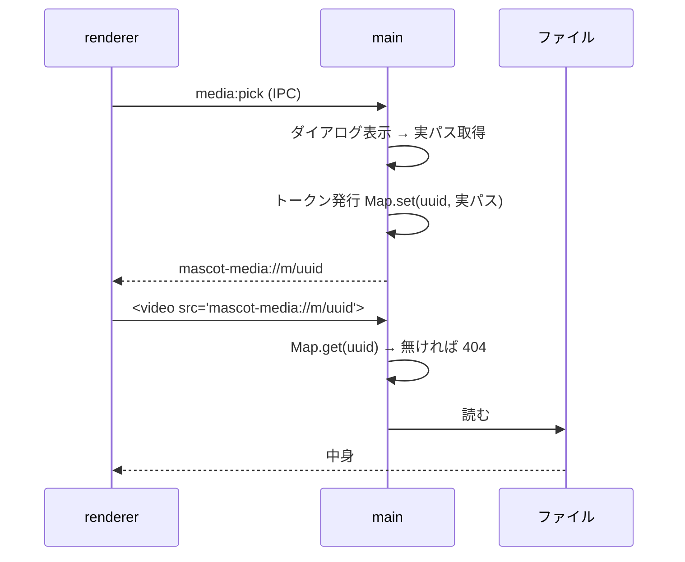

# M4-2 で出てきた見慣れない概念

「手元の画像/動画をマスコットに設定する」を実装する過程で使った、
説明なしだと分かりにくい仕組みをまとめる。

## 1. なぜ `file://` で直接表示しないのか

Electron の renderer(= Web ページ側)は「乗っ取られうる場所」として扱う。
XSS や悪意ある依存ライブラリが1つ紛れ込めば、renderer で任意の JS が走る。

もし `` のように実パスで参照する設計にすると、
乗っ取られた renderer は `file:///C:/Users/…/秘密.txt` を読める。
**「表示に使う仕組み」がそのまま「任意ファイル読み出し器」になる**のが問題。

M1 の保存処理で使った allowedPaths(= dialog を通ったパスにだけ書き込む)と
同じ考え方を、今回は読み出し側にも伸ばした。

## 2. カスタムプロトコルとトークン

`mascot-media://` という**このアプリ専用の URL スキーム**を作り、main プロセスが
配信を担当する。renderer が受け取るのはこういう URL:

```
mascot-media://m/9f2c3a1e-...-b7d4
                 └ ただのランダムな ID。パスの情報はゼロ
```

main 側は `Map<トークン, 実パス>` を持っていて、要求が来たら Map を引くだけ。
ここが肝で、**実パスを組み立てる処理がそもそも存在しない**。



よくある「パスを受け取って `../` が含まれていないか検証する」方式より強い。
検証は**書き漏らせる**が、経路が無い設計は書き漏らしようがない。
(`..%2F..%2Fetc%2Fpasswd` のような URL も、単に「知らないトークン」として 404 になる)

## 3. CSP を触らないと無言で壊れる

`index.html` の Content-Security-Policy は「どこからリソースを読んでよいか」の宣言。
既定は `default-src 'self'` = 自分自身のみで、新しく作った `mascot-media:` も
ブラウザ側の `blob:` も**許可リストに無いので黙って捨てられる**。

エラーも出ず「なぜか表示されない」になるので、対応形式を増やした時は
CSP の `img-src` / `media-src` も見ること。特に `media-src` は**明示しないと
`default-src` に落ちる**ため、画像は映るのに動画だけ死ぬ、という症状になる。

## 4. blob URL(ブラウザ側)

ブラウザには「ユーザーが選んだファイルの実パス」は渡ってこない(セキュリティ上の仕様)。
代わりに `URL.createObjectURL(file)` で `blob:http://…/uuid` という
**このタブの中だけで有効な一時的な参照**を作る。

ファイル全体を文字列としてメモリに載せる data URL と違い、blob URL は
中身をコピーしないので大きな動画でも軽い。使い終わったら `revokeObjectURL` で
解放する(しないと参照が残り続ける)。

Electron のトークンと blob URL は「実体への間接参照＋あとで解放が要る」点が同じなので、
`mediaService` では両方を `release()` という同じ形にまとめて、
App 側からは区別せずに扱えるようにしている。

## 5. React StrictMode と「解放」の相性

開発時の React は、バグ検出のために更新関数や effect を**わざと2回**呼ぶ。
そのため `setState(prev => { prev.release(); return next })` のように
更新関数の中で解放すると、生きている URL まで解放してしまう。

解放のような副作用は更新関数の外(今回は ref を使った `applyOverride`)で行う。

## 6. `--ozone-platform=headless`

WSL のように画面が無い環境では、Electron は X サーバーに接続しようとして
`app.whenReady()` が返ってこないまま固まる(エラーも出ない)。
`--ozone-platform=headless` を渡すと画面なしで起動する。

注意点として、**この旗は `app.commandLine.appendSwitch` では効かない**。
表示プラットフォームの選択は JS が動き出す前に済んでいるため、
`electron` コマンドの引数として渡す必要がある(`package.json` の `check:media` 参照)。

## 7. Range リクエストを転送しなかった理由

動画のシーク(途中への飛び先読み)は、HTTP の `Range: bytes=…` ヘッダで
「この範囲だけくれ」と要求し、サーバーが `206 Partial Content` で返す仕組み。

今回 `net.fetch` に Range を転送してみたところ、Electron の file 読み出しは
**`200 OK` のまま本文だけ切り詰めて**返した(実測)。これは「全部返した」と
嘘をつく応答で、途中で切れた動画として扱われかねない。

Range を無視して常に全体を 200 で返すのは HTTP 的に正しい振る舞いなので、
転送しない方を選んだ。マスコットは自動再生ループでシークバーも無く、実害が無い。
シークが要る用途が出たら、`fs.createReadStream(path, { start, end })` で
自前で 206 を組み立てることになる。
