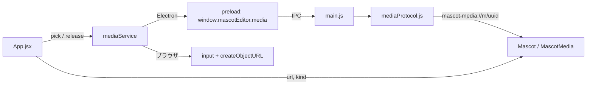

# M4-2: メディアピッカー実装まとめ

Issue #9 / PR: `feat/9-media-picker`

## 何ができるようになったか
ツールバーの「キャラ素材…」から手元の画像/動画を選び、マスコットに設定できる。
「戻す」で同梱素材に復帰。選んだ 1 つを全状態(idle/happy/error)へ適用する
(状態ごとの割当は M4-3、永続化は M4-4/M5)。

Electron でもブラウザ(GitHub Pages プレビュー)でも同じ操作で動く。

## 構成

| ファイル | 役割 |
|---|---|
| `src/main/mediaProtocol.js`(新) | `mascot-media://` の登録・トークン発行/破棄・配信 |
| `src/main/main.js` | `media:pick` / `media:release` IPC、ウィンドウのガード |
| `src/renderer/services/mediaService.js`(新) | 環境切替(Electron / ブラウザ)。`fileService` と同じ形 |
| `config/media-extensions.json`(新) | 対応拡張子の唯一の出所。main と renderer の両方が読む |
| `scripts/check-media-protocol.js`(新) | 境界の回帰ガード(`npm run check:media`、14/14) |

## 設計判断

- **トークン方式**: renderer には実パスを渡さず `mascot-media://m/<uuid>` だけ。
  パスを組み立てる経路が無いので、パストラバーサルが構造的に成立しない。
  「検証で防ぐ」より「経路を作らない」方が書き漏らしに強い。
- **`fileService` との対称性**: `App` は `pick()` が `{ url, kind, name, release }` を
  返すことだけ知る。環境判定も後始末の実体も service 内に閉じる。
- **Mascot へは `{ url, kind }` だけ渡す**: `release` はリソース管理の関心事で、
  表示コンポーネントに降ろさない(M4-1 の契約と同じ形に揃う)。
- **Range 転送はしない**: Electron の file 読み出しが 206 を返さず「200 なのに
  本文だけ切り詰め」になるため。詳細は `knowledge/01-custom-protocol.md`。

## レビュー(reviewer サブエージェント)対応
🔴 must は 0 件。🟡/🟢 のうち以下を取り込んだ:

- トークンから拡張子を削除(不透明化)。`%` や `#` を含む拡張子で自分の URL が
  引けなくなる非対称があった。kind 判定は元のファイル名を使っているので影響なし。
- `setWindowOpenHandler` で新規ウィンドウを拒否 + `will-navigate` を自分の画面に限定。
  子ウィンドウは親の `preload` を継承するため、素材を特権付き document として
  開かれる経路を塞ぐ。
- ダイアログの「すべて」フィルタを廃止し、選択後にも拡張子を検証。
  任意ファイル(HTML など)にトークンを発行しない。
- リロード/ウィンドウ破棄で全トークンを破棄(`did-start-navigation` / `destroyed`)。
  renderer 側の `release` は Ctrl+R では走らないため。
- `protocol.handle` を try/catch し、素材が消えていても 404 に落とす。
- 拡張子リストの二重管理を `config/media-extensions.json` に一本化。
- host 固定の検証、`supportFetchAPI` の削除(最小権限)、`input.oncancel`、
  ダイアログのモーダル化、検証スクリプトの自己完結化。

見送り: アンマウント中のダイアログ完了で ref 更新が走る件(実害ほぼ無し)。

## 次
- M4-3: 状態ごとの個別割当 UI
- M4-4/M5: 選択内容の永続化(Electron は実パスを保存して起動時にトークン再発行、
  ブラウザは blob URL が寿命切れするためメタのみ、という非対称の設計が要る)
