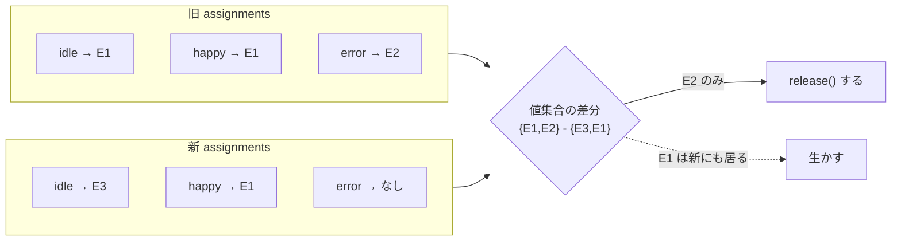

# M4-3: 状態ごとの素材割当 UI + プレビュー

Issue #11 / PR: `feat/11-per-state-media`

## 何ができるようになったか

- idle / happy / error に **それぞれ別の画像・動画** を割り当てられる。
- 未割当の状態は、これまで通り同梱サンプル(`config/mascots/*.json` の `states`)が出る。
- 「全部に適用」で 1 回の選択を全状態へ入れられる(M4-2 の挙動をボタンとして残した形)。
- 割当行にホバー/フォーカスしている間だけ、その状態の見た目をプレビューできる。

## 設計のポイント

### 1. 割当は「状態 → エントリ」のマップ

```
assignments = { idle: entry|null, happy: entry|null, error: entry|null }
```

行数は `statesOf(mascot)` = JSON の `states` のキー由来。JSON に状態を足せば
UI の行も自動で増える(本体のコードを触らずに拡張できる = OCP)。

### 2. 解放(release)は集合の差分で決める

これが今回いちばん間違えやすい所。素材エントリは `release()` を持つ
(Electron はトークン破棄 / ブラウザは `revokeObjectURL`)が、
**同じエントリを複数の状態が参照しうる**(「全部に適用」直後など)。
状態ごとに素朴に release すると、まだ happy が使っている URL を idle の差し替えで殺してしまう。



判定は `src/renderer/services/mediaAssignments.mjs` の `entriesToRelease(prev, next)`
に純粋関数として切り出した。副作用(実際の `release()` 呼び出しと `setState`)は
`App.jsx` の `applyAssignments` が持つ。

- **参照カウントを採らなかった理由**: 可変カウンタを React state の外に置くことになり、
  StrictMode の二重呼び出しと相性が悪い(M4-2 で一度踏んだ罠)。
- 純粋関数なので `scripts/check-media-assignments.mjs` から **実物を import して** 検査できる。
  コピーではなく実装そのものを縛れる(`npm run check:assign`、CI でも実行)。
- 拡張子が `.mjs` なのは、`package.json` に `"type": "module"` が無い(main プロセスが CJS)ため。
  `.js` のままだと Node が ESM として読み込めず、素の Node で検査できない。

### 3. 表示層に渡す情報は最小に

| 渡し先 | 使う関数 | 渡るもの |
|---|---|---|
| `Mascot` | `toDisplayMap` | `{ url, kind }` だけ |
| `MediaAssignPanel` | `toNameMap` | 表示名だけ |

`release` はリソース管理の関心事なので、どちらの表示コンポーネントにも渡さない。

### 4. プレビューは Mascot に概念を持ち込まない

`state={previewState ?? mascotState}` と App 側で畳んでいるので、
`Mascot` は「プレビュー」という UI 操作を知らない。実際の `mascotState` は
変わらないため、表情連動(編集中/保存/エラー)はそのまま動く。

プレビューが張り付くと表情連動が画面に出なくなるので、解除は多重化した:
`mouseleave` / `blur` に加えて、**ボタン押下時**(ネイティブダイアログが開くと
`mouseleave` が飛ばない・`×` は押下で disabled になり `blur` が来ない)と
**ウィンドウの blur** でも畳む。

## 非同期まわりで気をつけたこと

- `pickInto` は `buildNext` を `await pick()` の **後** に評価する。
  ダイアログ表示中に別の割当が変わっても、常に最新のマップの上に載る(後勝ちで一貫)。
- `pick()` の解決前にアンマウントされたら、選ばれた素材をその場で `release()` して捨てる
  (`aliveRef`)。捨てないと後始末後に ref へ入り、誰も解放しないまま残る。
- アンマウント時の後始末は `setState` を含む `applyAssignments` を使わず、ref を読んで
  release するだけにした。dev の Fast Refresh で effect が張り直された時に
  「まだ生きているのに割当が空に戻る」のを避けるため。

## 検査

```
npm run check         # check:media (14) + check:assign (11)
npm run build
```

## スコープ外(次)

- **M4-4 / M5: 永続化**。今はリロードで割当が消える。
  Electron のトークンは使い捨てなので、保存するのは「実パス」になる。
  M1 の `allowedPaths` と同じ考え方で、復元時に再度トークンを発行する設計が要る。
