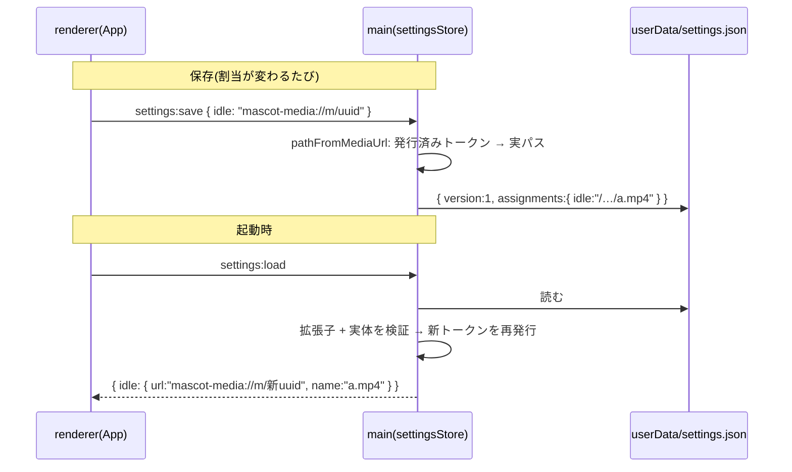

# M4-4: 素材割当の永続化

Issue #13 / ブランチ: `feat/13-persist-assignments`

## 何ができるようになったか

- 状態(idle/happy/error)ごとに選んだ画像・動画が、**アプリを閉じても残る**。
  次回起動時に自動で復元される(リロード Ctrl+R でも同じ)。
- 選んだ素材が移動・削除されていたら、その状態だけ黙って同梱サンプルへ戻る
  (エラーで起動が止まったりはしない)。
- ブラウザ(GitHub Pages プレビュー)では割当は保存されない。理由は下記。

## なぜ「URL を保存」ではダメだったか

割当が持っている URL は、どちらも**その場限りの参照**でしかない。

| 環境 | URL | 寿命 |
| --- | --- | --- |
| Electron | `mascot-media://m/<uuid>` | リロード/ウィンドウ破棄で全破棄 |
| ブラウザ | `blob:…` | タブを閉じたら消える |

次回起動しても指し直せる同一性は**実ファイルパス**しかない。
ところが M4-2 で「実パスは main に閉じ、renderer へは渡さない」と決めてある。
renderer に保存させると、その防御線を自分で壊すことになる。

## 設計: 保存も復元も main が担う

renderer は一度も実パスを見ない。渡すのも受け取るのも不透明な URL だけ。

## 守っている 3 つの線

### 1. 保存時: renderer は任意パスを設定へ書き込めない

設定に書けるのは `pathFromMediaUrl()` が解決できた URL、つまり
**一度 dialog を通って発行されたトークン**だけ。`file:///etc/passwd` を送ろうが
生パスを送ろうが解決できず、その値は入らない。M1 の `allowedPaths`(書き込み)、
M4-2 のトークン(読み出し)と同じ考え方を、保存にも延ばした形。

ただし「解決できなかった = 消す」にはしない。解決できない理由は 2 つあり、
main からは区別できないため:

- 偽装 URL(乗っ取られた renderer からの注入)
- リロードでトークンが一括破棄された後に届いた、遅れてきた保存

そこで**その状態に既に保存されているパスがあれば残す**。攻撃者の文字列は
解決できない以上入り込めず、正当な設定は競合で消えない。
一方「キー自体が来ていない」は割当の解除なので、素直に消える。

### 2. 復元時: 設定ファイルを外から書き換えられても任意ファイルを読ませない

`settings.json` は userData 配下のただのファイルで、アプリ外から編集できる。
無検証で復元すると「任意ローカルファイルへトークンを発行する口」に化けるので、
復元時にも **絶対パスか / 対応形式の拡張子か / 実体が存在する通常ファイルか** を検証する。
シンボリックリンクは実体側の拡張子でも検証する(`a.webm` → `/etc/shadow` を弾く)。
落ちたものは黙って外し、その状態は同梱素材になる。

キーも入力として扱う。復元件数には上限(32)を設け、マスコットが持たない状態名は
renderer 側で捨てる(UI に出ないまま素材を掴み続けないように)。
`__proto__` のようなキーが来てもプロトタイプ差し替えにならないよう、
信頼できない出所の辞書は `Object.create(null)` で組む。

**復元結果は保存し返さない。** 検証に落ちた分が間引かれた状態で書き戻されると、
「USB を挿し忘れて起動したら割当が永久に消えた」が起きる。

### 3. 復元後も「同じ素材は同じエントリ」

同一パスには 1 つしかトークンを発行せず(main)、同一 URL は 1 エントリへ寄せる
(renderer の `fromRestored`)。ここを分けてしまうと、M4-3 の解放判定
(`entriesToRelease` = 集合の差分)が同じ素材を別物と見なし、
まだ他の状態が使っている URL を殺しにいく。

## ブラウザで割当を保存しない理由

`blob:` URL はタブを閉じた時点で死んでおり、`File` への参照も残らない
(復元するには File System Access API のハンドルを IndexedDB へ入れる等、別の仕組みが要る)。
保存しても次回は必ず壊れた参照になるので、`settingsService`(web)は割当を捨てる。
**復元できるふりをしない**方が、ユーザーにとって嘘がない。
テーマなど復元できる設定は同じ localStorage に残す(M5 で使う)。

## 追加/変更したファイル

| ファイル | 役割 |
| --- | --- |
| `src/main/mediaFormats.js` | 対応形式の判定を main 側で一元化(選択時と復元時の両方で使う) |
| `src/main/settingsStore.js` | `settings.json` の読み書き。保存先とトークン操作を注入する形(素材の参照方式に依存しない) |
| `src/main/mediaProtocol.js` | `pathFromMediaUrl` を追加(main 内部専用) |
| `src/main/main.js` / `preload.js` | `settings:load` / `settings:save` の IPC |
| `src/renderer/services/settingsService.js` | 環境切替(Electron=IPC / ブラウザ=localStorage) |
| `src/renderer/services/mediaService.js` | `adopt()` = 復元された素材をエントリへ仕立てる |
| `src/renderer/services/mediaAssignments.mjs` | `toUrlMap`(保存用) / `fromRestored`(復元 + dedupe) / `pickStates`(未知の状態を落とす) |
| `src/renderer/App.jsx` | マウント時に復元、割当変更時に保存 |
| `scripts/check-settings-store.js` | 上記 3 つの線の回帰ガード(`npm run check:settings`) |

## 実装で気をつけた細かい所

- **書き込みは原子的に**: 一時ファイルへ書いてから `rename`。書き込み中に落ちても
  途中まで書けた設定が残らない。連続保存はプロセス内で直列化し、
  「既存を読む → 重ねる → 書く」の間に別の保存が割り込まないようにする
  (二重起動までは守れない。単一インスタンス化は別の課題)。
- **保存は部分更新**: 渡したキーだけを差し替える。全置換にすると、M5 でテーマを
  足した瞬間に「割当を変えるとテーマが消える」バグになる。ブラウザ側も同じ挙動に揃えた。
- **壊れた設定で起動不能にしない**: パース失敗・未知の `version`・ファイル無しは
  すべて「設定なし」に倒す。
- **復元中のアンマウント/先行操作**: 復元の解決を待つ間に画面が消えたり、
  ユーザーが先に操作していたら、復元分は捨てて解放する。上書きすると
  先に選ばれたエントリが誰にも解放されないまま参照を失う(StrictMode の二重マウントで実際に踏む)。
  判定は「今の割当が空か」ではなく「一度でも操作したか」で行う(選んでから解除すると空に戻るため)。
- **`load` を呼ぶたび前回の復元トークンを捨てる**: 捨てないと、繰り返し呼ぶだけで
  main のトークン表を無限に太らせられる。
- **保存は投げっぱなし**: 割当変更の副産物なので完了を待たない。失敗しても編集は続く。

## 検証

- `npm run check` = `check:media`(14) + `check:assign`(24) + `check:settings`(35) 全通過。
- `npm run build` 通過。
- 画面上での確認は未実施(この WSL 環境では Electron のウィンドウが起動しないため)。
  renderer ↔ main の往復は IPC 層(`check:settings`)と純粋関数(`check:assign`)で検証している。
